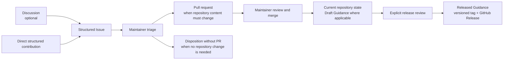
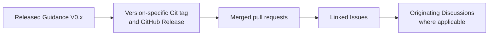
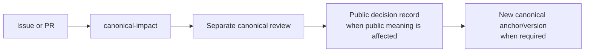
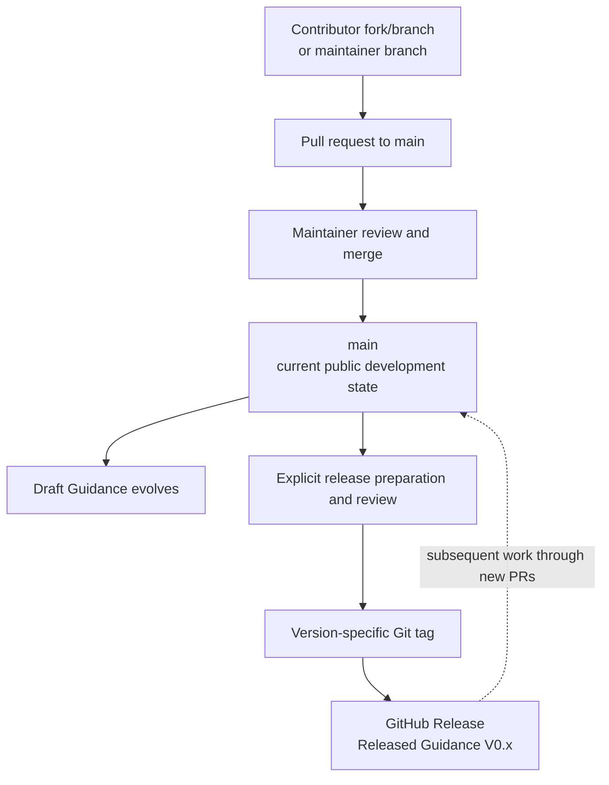

# EKR Repository Governance

## 1. Purpose

This document defines the current public governance of the EKR repository: artefact statuses, decision rights, contribution progression, escalation, traceability and release logic.

The repository is a public development workspace. It is not the canonical Working Definition and it does not replace the separate review and release process for canonical EKR claims and publications.

This governance may evolve as the EKR development process matures. Changes are made explicitly through the repository and remain subject to the canonical-impact rules defined below; a governance edit does not by itself redefine canonical EKR.

## 2. Three distinct forms of authority

EKR repository governance distinguishes three forms of authority even when the same person may exercise more than one role.

### Public discussion authority

Anyone participating through Discussions, Issues or pull requests may question, challenge, propose, provide evidence or suggest alternatives. Participation gives a contribution visibility; it does not give it EKR status.

### Repository-maintainer authority

The maintainer manages repository housekeeping, navigation, labels, contribution triage, traceability and draft artefacts. The maintainer may classify contributions, request evidence, close duplicates, assign release milestones and merge changes that remain within the current public EKR boundary and do not create a new material public claim.

Repository write and merge access is reserved to maintainers authorised to exercise the corresponding repository decision rights. GitHub permission is the technical implementation of those rights; it does not independently create EKR governance authority. A contributor does not become a maintainer by submitting a pull request, and granting technical access must follow an explicit governance decision.

### Canonical EKR authority

Canonical-impact changes follow a separate governed path. Under the current governance, the canonical steward is **Jean Vieille**. Canonical authority is not delegated to issue popularity, contributor count, maintainer preference or an ordinary pull-request merge.

## 3. Artefact status model

| Status | Meaning | Typical artefact |
|---|---|---|
| **Canonical** | Published, versioned and formally designated as a canonical EKR anchor. | Working Definition V0.1 and future explicitly designated canonical anchors. |
| **Released Guidance** | Versioned guidance accepted for public use at a stated maturity. It remains evolvable and is not a standard or certification scheme. | EKR Architectural Guidance release. |
| **Draft Guidance** | Guidance under governed development; content may change materially. | Guidance seed and working drafts. |
| **Proposal** | Structured suggestion, alternative, pattern or change request submitted for evaluation. | Issue or proposal artefact. |
| **Example** | Non-normative illustration, implementation experience or case used to test guidance. | Contributed example or case. |
| **Discussion** | Conversation, question, challenge or exploration with no acquired EKR status. | GitHub Discussion. |

GitHub labels, milestones, branches and open/closed states support workflow and traceability. They are **not additional EKR statuses**.

## 4. Normal public progression

The normal progression is:

**Discussion (optional) → structured Issue → triage → PR where a repository change is needed → Draft Guidance / repository update → release review → Released Guidance**

This is not an automatic promotion pipeline.

- A contributor may open a structured Issue directly when prior Discussion is unnecessary.
- A Discussion may end without an Issue or decision.
- An Issue may be accepted for investigation or work without accepting its conclusion.
- Not every Issue requires a PR.
- A merged pull request may update Draft Guidance or a repository artefact without changing a canonical anchor.
- A Released Guidance document does not become Canonical merely by being released.
- Canonical change follows the separate escalation path described below.

## 5. Decision rights

The table below states the **current** decision authorities. These may evolve through explicit governance changes, subject to the same canonical-impact safeguards.

| Decision class | Current authority | Rule |
|---|---|---|
| Repository housekeeping, labels and navigation | Maintainer | May be changed directly if conceptual meaning or artefact status is not altered. |
| Discussion triage and issue classification | Maintainer | May classify, request evidence, close duplicates, create/link an Issue from a Discussion, or disposition an Issue; this does not decide canonical truth. |
| Release-milestone assignment | Maintainer | Indicates intended release scope for tracking only; it does not guarantee inclusion or confer EKR status. |
| Draft Guidance wording | Maintainer, subject to current EKR governance | May be merged after review when it remains within the current public EKR boundary and creates no new material public claim. |
| Guidance release | Maintainer under this governance and the applicable release review | Requires an explicit versioned release decision; a milestone completion or PR merge alone is insufficient. |
| New material public claim | Separate claim review | Requires explicit review and classification before it is published as an EKR position. Text that only supports or clarifies an existing controlled position may be treated as supporting detail. |
| Canonical-impact or canonical-anchor change | Canonical steward, currently Jean Vieille | May be proposed publicly but cannot be accepted through ordinary popularity or PR merge. Accepted public-impact decisions require a public decision record; an anchor change requires a new controlled version or release. |
| Matter outside the repository's current public scope | Applicable governance outside this repository | The repository cannot make such material public or give it EKR status. It may enter the repository's scope only after the applicable publication, protection, security, intellectual-property or other governance decision has authorised public treatment. |

## 6. Issue lifecycle and disposition

Structured Issues are the normal tracking objects for contributions that need evaluation or action.

New Issue Forms apply the `triage` label. Initial triage may result in a request for clarification or evidence, assignment to a release milestone, deferral, closure with rationale, or canonical-impact escalation.

The Issue should remain the public record of the question and its disposition even when a PR implements the resulting change. A closed Issue does not necessarily mean that the contributor's proposed conclusion was accepted; the closing comment should make the disposition clear when the reason is not obvious from the linked PR.

If an Issue originates in a Discussion, the relationship should remain visible by cross-reference. When practical, maintainers should use GitHub's discussion-to-issue route or add links manually in both directions.

## 7. Pull requests, branches and draft integration

For substantive repository changes, a pull request should normally link the Issue it addresses.

The normal target branch is `main`. Ordinary contributors normally work on a branch in their own fork and open a pull request against `jvieille/ekr:main` (using GitHub's cross-fork comparison where needed). Maintainers may work on a non-`main` branch in the repository or in a fork, but the change still enters `main` through a pull request.

`main` is the protected **current public development state** of the repository. It is not synonymous with **Released Guidance**, and a permanent `draft` branch is not required. Draft/Released/Canonical are artefact statuses, not branch names.

GitHub workflow states such as **Draft pull request**, **Open**, **Merged** or **Closed** are repository workflow states. They must not be confused with EKR artefact statuses such as **Draft Guidance** or **Released Guidance**.

When a PR fully resolves an Issue, the preferred convention is `Closes #<issue>` so GitHub closes the Issue when the PR is merged into the default branch. When the PR is only one step in a larger Issue, use a normal cross-reference such as `Relates to #<issue>` and leave the Issue open.

Small housekeeping or typographical changes may be merged without a prior Issue when their scope is self-evident and they do not alter conceptual meaning or artefact status.

Where branch protection requires pull-request review conversations to be resolved before merge, a published unresolved review conversation is a merge blocker. Contributors address such feedback through the existing review thread and, when required, by updating the PR branch. Starting a separate review on one's own PR is not required for disposition of maintainer feedback.

A maintainer merge into `main` is a governed acceptance of that change into the current repository state. If it changes Draft Guidance, it changes the **draft**, not the release status. Merge authority therefore carries repository decision authority only within the scope assigned to the maintainer under this governance; it does not by itself authorise a Guidance release, a new material public claim or a canonical change.

## 8. Release planning and traceability

Milestones may be used to group Issues and PRs intended for a particular Guidance release. A milestone expresses intended release scope and provides progress visibility; it is not a release decision and does not change artefact status.

The intended traceability chain is:

**Released Guidance → Git tag / GitHub Release → merged PRs → linked Issues → originating Discussions, where applicable**

To preserve that chain:

- release-targeted Issues and PRs should be associated with the relevant milestone where practical;
- substantive PRs should link the Issues they implement;
- Issues should link originating Discussions when one exists;
- Guidance release notes should identify the merged PRs included in the released version;
- the Guidance changelog should record each versioned release and point to the corresponding release record.

The initial public seed predates this contribution-lifecycle convention; subsequent substantive changes should follow it.

## 9. Canonical-impact escalation

A contribution is escalated when it would materially alter a canonical EKR distinction, an existing material public claim, the current public scope or publication boundary, or an existing canonical anchor.

Such a contribution may be discussed publicly, but it is not accepted canonically through ordinary repository workflow. It enters separate review. If the resulting decision materially affects public EKR meaning, the outcome and rationale are recorded publicly in [`governance/decisions/`](governance/decisions/).

Non-public control or review material cannot silently redefine public EKR. A change to an existing canonical anchor becomes effective only through a controlled new version or release of that anchor.

See [`governance/CANONICAL-POLICY.md`](governance/CANONICAL-POLICY.md).

## 10. Guidance release logic

Draft Guidance is explicitly provisional. The current draft may evolve on `main` through reviewed pull requests. A version becomes **Released Guidance** only through an explicit release decision after review of:

- the intended version scope and unresolved items;
- the relevant evidence, implementation experience and challenges;
- linked Issues and merged PRs;
- claim and canonical impact;
- public-scope and boundary conditions;
- version metadata and changelog accuracy.

When approved, the release is fixed to a version-specific Git tag and published as a GitHub Release with release notes. The corresponding Guidance changelog entry records the release and its status. The associated milestone may then be closed after any remaining items have been explicitly moved, deferred or otherwise dispositioned. New work then continues on `main` through new pull requests while the tagged release remains immutable.

Release does not imply standardisation, certification, universal applicability or canonical status.

## 11. Conflicts and unresolved questions

Where a contribution cannot be resolved without changing a canonical distinction, introducing a new material public claim, altering the current public scope or publication boundary, or deciding whether non-public material may be released, the repository does not decide the matter by vote or merge. The item is referred to the applicable review or governance process and may remain open as a Proposal or Discussion until that process is complete.

## 12. Repository neutrality

Repository governance must not turn EKR into a product channel, a platform mandate, a hidden reference implementation or a vehicle for privileging one technology. Implementation experience is welcome as evidence, but it remains non-normative unless deliberately incorporated into versioned guidance under this process.
